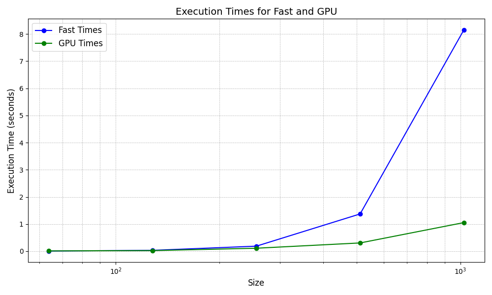

# MiniTorch Module 3


* Docs: https://minitorch.github.io/

* Overview: https://minitorch.github.io/module3.html


You will need to modify `tensor_functions.py` slightly in this assignment.

* Tests:

```
python run_tests.py
```

* Note:

Several of the tests for this assignment will only run if you are on a GPU machine and will not
run on github's test infrastructure. Please follow the instructions to setup up a colab machine
to run these tests.

This assignment requires the following files from the previous assignments. You can get these by running

```bash
python sync_previous_module.py previous-module-dir current-module-dir
```

The files that will be synced are:

        minitorch/tensor_data.py minitorch/tensor_functions.py minitorch/tensor_ops.py minitorch/operators.py minitorch/scalar.py minitorch/scalar_functions.py minitorch/module.py minitorch/autodiff.py minitorch/module.py project/run_manual.py project/run_scalar.py project/run_tensor.py minitorch/operators.py minitorch/module.py minitorch/autodiff.py minitorch/tensor.py minitorch/datasets.py minitorch/testing.py minitorch/optim.py

Parallel Analytics Script:
MAP

================================================================================
 Parallel Accelerator Optimizing:  Function tensor_map.<locals>._map,
/Users/carterhe/Desktop/MLE
Codes/workspace/mod3-CarterHe479/minitorch/fast_ops.py (163)
================================================================================


Parallel loop listing for  Function tensor_map.<locals>._map, /Users/carterhe/Desktop/MLE Codes/workspace/mod3-CarterHe479/minitorch/fast_ops.py (163)
-----------------------------------------------------------------------------|loop #ID
    def _map(                                                                |
        out: Storage,                                                        |
        out_shape: Shape,                                                    |
        out_strides: Strides,                                                |
        in_storage: Storage,                                                 |
        in_shape: Shape,                                                     |
        in_strides: Strides,                                                 |
    ) -> None:                                                               |
        # TODO: Implement for Task 3.1.                                      |
        if (                                                                 |
            len(out_strides) != len(in_strides)                              |
            or (out_strides != in_strides).any()-----------------------------| #0
            or (out_shape != in_shape).any()---------------------------------| #1
        ):                                                                   |
            for i in prange(len(out)):---------------------------------------| #5
                out_index = np.zeros(MAX_DIMS, dtype=np.int32)---------------| #2
                in_index = np.zeros(MAX_DIMS, dtype=np.int32)----------------| #3
                to_index(i, out_shape, out_index)                            |
                broadcast_index(out_index, out_shape, in_shape, in_index)    |
                out[index_to_position(out_index, out_strides)] = fn(         |
                    in_storage[index_to_position(in_index, in_strides)]      |
                )                                                            |
        else:                                                                |
            for i in prange(len(out)):---------------------------------------| #4
                out[i] = fn(in_storage[i])                                   |
--------------------------------- Fusing loops ---------------------------------
Attempting fusion of parallel loops (combines loops with similar properties)...

Fused loop summary:
+--2 has the following loops fused into it:
   +--3 (fused)
Following the attempted fusion of parallel for-loops there are 5 parallel for-
loop(s) (originating from loops labelled: #0, #1, #5, #2, #4).
--------------------------------------------------------------------------------
---------------------------- Optimising loop nests -----------------------------
Attempting loop nest rewrites (optimising for the largest parallel loops)...

+--5 is a parallel loop
   +--2 --> rewritten as a serial loop
--------------------------------------------------------------------------------
----------------------------- Before Optimisation ------------------------------
Parallel region 0:
+--5 (parallel)
   +--2 (parallel)
   +--3 (parallel)


--------------------------------------------------------------------------------
------------------------------ After Optimisation ------------------------------
Parallel region 0:
+--5 (parallel)
   +--2 (serial, fused with loop(s): 3)


Parallel region 0 (loop #5) had 1 loop(s) fused and 1 loop(s) serialized as part
 of the larger parallel loop (#5).
--------------------------------------------------------------------------------
--------------------------------------------------------------------------------

---------------------------Loop invariant code motion---------------------------
Allocation hoisting:
The memory allocation derived from the instruction at
/Users/carterhe/Desktop/MLE
Codes/workspace/mod3-CarterHe479/minitorch/fast_ops.py (178) is hoisted out of
the parallel loop labelled #5 (it will be performed before the loop is executed
and reused inside the loop):
   Allocation:: out_index = np.zeros(MAX_DIMS, dtype=np.int32)
    - numpy.empty() is used for the allocation.
The memory allocation derived from the instruction at
/Users/carterhe/Desktop/MLE
Codes/workspace/mod3-CarterHe479/minitorch/fast_ops.py (179) is hoisted out of
the parallel loop labelled #5 (it will be performed before the loop is executed
and reused inside the loop):
   Allocation:: in_index = np.zeros(MAX_DIMS, dtype=np.int32)
    - numpy.empty() is used for the allocation.
None
ZIP

================================================================================
 Parallel Accelerator Optimizing:  Function tensor_zip.<locals>._zip,
/Users/carterhe/Desktop/MLE
Codes/workspace/mod3-CarterHe479/minitorch/fast_ops.py (215)
================================================================================


Parallel loop listing for  Function tensor_zip.<locals>._zip, /Users/carterhe/Desktop/MLE Codes/workspace/mod3-CarterHe479/minitorch/fast_ops.py (215)
---------------------------------------------------------------------------------------|loop #ID
    def _zip(                                                                          |
        out: Storage,                                                                  |
        out_shape: Shape,                                                              |
        out_strides: Strides,                                                          |
        a_storage: Storage,                                                            |
        a_shape: Shape,                                                                |
        a_strides: Strides,                                                            |
        b_storage: Storage,                                                            |
        b_shape: Shape,                                                                |
        b_strides: Strides,                                                            |
    ) -> None:                                                                         |
        # TODO: Implement for Task 3.1.                                                |
        if (                                                                           |
            len(out_strides) != len(a_strides)                                         |
            or len(out_strides) != len(b_strides)                                      |
            or (out_strides != a_strides).any()----------------------------------------| #6
            or (out_strides != b_strides).any()----------------------------------------| #7
            or (out_shape != a_shape).any()--------------------------------------------| #8
            or (out_shape != b_shape).any()--------------------------------------------| #9
        ):                                                                             |
            for i in prange(len(out)):-------------------------------------------------| #14
                out_index = np.zeros(MAX_DIMS, dtype=np.int32)-------------------------| #10
                a_index = np.zeros(MAX_DIMS, dtype=np.int32)---------------------------| #11
                b_index = np.zeros(MAX_DIMS, dtype=np.int32)---------------------------| #12
                to_index(i, out_shape, out_index)                                      |
                broadcast_index(out_index, out_shape, a_shape, a_index)                |
                broadcast_index(out_index, out_shape, b_shape, b_index)                |
                a_data = a_storage[index_to_position(a_index, a_strides)]              |
                b_data = b_storage[index_to_position(b_index, b_strides)]              |
                out[index_to_position(out_index, out_strides)] = fn(a_data, b_data)    |
        else:                                                                          |
            for i in prange(len(out)):-------------------------------------------------| #13
                out[i] = fn(a_storage[i], b_storage[i])                                |
--------------------------------- Fusing loops ---------------------------------
Attempting fusion of parallel loops (combines loops with similar properties)...

Fused loop summary:
+--10 has the following loops fused into it:
   +--11 (fused)
   +--12 (fused)
Following the attempted fusion of parallel for-loops there are 7 parallel for-
loop(s) (originating from loops labelled: #6, #7, #8, #9, #14, #10, #13).
--------------------------------------------------------------------------------
---------------------------- Optimising loop nests -----------------------------
Attempting loop nest rewrites (optimising for the largest parallel loops)...

+--14 is a parallel loop
   +--10 --> rewritten as a serial loop
--------------------------------------------------------------------------------
----------------------------- Before Optimisation ------------------------------
Parallel region 0:
+--14 (parallel)
   +--10 (parallel)
   +--11 (parallel)
   +--12 (parallel)


--------------------------------------------------------------------------------
------------------------------ After Optimisation ------------------------------
Parallel region 0:
+--14 (parallel)
   +--10 (serial, fused with loop(s): 11, 12)


Parallel region 0 (loop #14) had 2 loop(s) fused and 1 loop(s) serialized as
part of the larger parallel loop (#14).
--------------------------------------------------------------------------------
--------------------------------------------------------------------------------

---------------------------Loop invariant code motion---------------------------
Allocation hoisting:
The memory allocation derived from the instruction at
/Users/carterhe/Desktop/MLE
Codes/workspace/mod3-CarterHe479/minitorch/fast_ops.py (236) is hoisted out of
the parallel loop labelled #14 (it will be performed before the loop is executed
 and reused inside the loop):
   Allocation:: out_index = np.zeros(MAX_DIMS, dtype=np.int32)
    - numpy.empty() is used for the allocation.
The memory allocation derived from the instruction at
/Users/carterhe/Desktop/MLE
Codes/workspace/mod3-CarterHe479/minitorch/fast_ops.py (237) is hoisted out of
the parallel loop labelled #14 (it will be performed before the loop is executed
 and reused inside the loop):
   Allocation:: a_index = np.zeros(MAX_DIMS, dtype=np.int32)
    - numpy.empty() is used for the allocation.
The memory allocation derived from the instruction at
/Users/carterhe/Desktop/MLE
Codes/workspace/mod3-CarterHe479/minitorch/fast_ops.py (238) is hoisted out of
the parallel loop labelled #14 (it will be performed before the loop is executed
 and reused inside the loop):
   Allocation:: b_index = np.zeros(MAX_DIMS, dtype=np.int32)
    - numpy.empty() is used for the allocation.
None
REDUCE

================================================================================
 Parallel Accelerator Optimizing:  Function tensor_reduce.<locals>._reduce,
/Users/carterhe/Desktop/MLE
Codes/workspace/mod3-CarterHe479/minitorch/fast_ops.py (273)
================================================================================


Parallel loop listing for  Function tensor_reduce.<locals>._reduce, /Users/carterhe/Desktop/MLE Codes/workspace/mod3-CarterHe479/minitorch/fast_ops.py (273)
--------------------------------------------------------------|loop #ID
    def _reduce(                                              |
        out: Storage,                                         |
        out_shape: Shape,                                     |
        out_strides: Strides,                                 |
        a_storage: Storage,                                   |
        a_shape: Shape,                                       |
        a_strides: Strides,                                   |
        reduce_dim: int,                                      |
    ) -> None:                                                |
        # TODO: Implement for Task 3.1.                       |
        for i in prange(len(out)):----------------------------| #16
            out_index = np.zeros(MAX_DIMS, dtype=np.int32)----| #15
            dim = a_shape[reduce_dim]                         |
            to_index(i, out_shape, out_index)                 |
            o = index_to_position(out_index, out_strides)     |
            accum = out[o]                                    |
            j = index_to_position(out_index, a_strides)       |
            s_tem = a_strides[reduce_dim]                     |
            for _ in range(dim):                              |
                accum = fn(accum, a_storage[j])               |
                j += s_tem                                    |
            out[o] = accum                                    |
--------------------------------- Fusing loops ---------------------------------
Attempting fusion of parallel loops (combines loops with similar properties)...
Following the attempted fusion of parallel for-loops there are 2 parallel for-
loop(s) (originating from loops labelled: #16, #15).
--------------------------------------------------------------------------------
---------------------------- Optimising loop nests -----------------------------
Attempting loop nest rewrites (optimising for the largest parallel loops)...

+--16 is a parallel loop
   +--15 --> rewritten as a serial loop
--------------------------------------------------------------------------------
----------------------------- Before Optimisation ------------------------------
Parallel region 0:
+--16 (parallel)
   +--15 (parallel)


--------------------------------------------------------------------------------
------------------------------ After Optimisation ------------------------------
Parallel region 0:
+--16 (parallel)
   +--15 (serial)


Parallel region 0 (loop #16) had 0 loop(s) fused and 1 loop(s) serialized as
part of the larger parallel loop (#16).
--------------------------------------------------------------------------------
--------------------------------------------------------------------------------

---------------------------Loop invariant code motion---------------------------
Allocation hoisting:
The memory allocation derived from the instruction at
/Users/carterhe/Desktop/MLE
Codes/workspace/mod3-CarterHe479/minitorch/fast_ops.py (284) is hoisted out of
the parallel loop labelled #16 (it will be performed before the loop is executed
 and reused inside the loop):
   Allocation:: out_index = np.zeros(MAX_DIMS, dtype=np.int32)
    - numpy.empty() is used for the allocation.
None
MATRIX MULTIPLY

================================================================================
 Parallel Accelerator Optimizing:  Function _tensor_matrix_multiply,
/Users/carterhe/Desktop/MLE
Codes/workspace/mod3-CarterHe479/minitorch/fast_ops.py (299)
================================================================================


Parallel loop listing for  Function _tensor_matrix_multiply, /Users/carterhe/Desktop/MLE Codes/workspace/mod3-CarterHe479/minitorch/fast_ops.py (299)
-----------------------------------------------------------------------------------------|loop #ID
def _tensor_matrix_multiply(                                                             |
    out: Storage,                                                                        |
    out_shape: Shape,                                                                    |
    out_strides: Strides,                                                                |
    a_storage: Storage,                                                                  |
    a_shape: Shape,                                                                      |
    a_strides: Strides,                                                                  |
    b_storage: Storage,                                                                  |
    b_shape: Shape,                                                                      |
    b_strides: Strides,                                                                  |
) -> None:                                                                               |
    """NUMBA tensor matrix multiply function.                                            |
                                                                                         |
    Should work for any tensor shapes that broadcast as long as                          |
                                                                                         |
    ```                                                                                  |
    assert a_shape[-1] == b_shape[-2]                                                    |
    ```                                                                                  |
                                                                                         |
    Optimizations:                                                                       |
                                                                                         |
    * Outer loop in parallel                                                             |
    * No index buffers or function calls                                                 |
    * Inner loop should have no global writes, 1 multiply.                               |
                                                                                         |
                                                                                         |
    Args:                                                                                |
    ----                                                                                 |
        out (Storage): storage for `out` tensor                                          |
        out_shape (Shape): shape for `out` tensor                                        |
        out_strides (Strides): strides for `out` tensor                                  |
        a_storage (Storage): storage for `a` tensor                                      |
        a_shape (Shape): shape for `a` tensor                                            |
        a_strides (Strides): strides for `a` tensor                                      |
        b_storage (Storage): storage for `b` tensor                                      |
        b_shape (Shape): shape for `b` tensor                                            |
        b_strides (Strides): strides for `b` tensor                                      |
                                                                                         |
    Returns:                                                                             |
    -------                                                                              |
        None : Fills in `out`                                                            |
                                                                                         |
    """                                                                                  |
    a_batch_stride = a_strides[0] if a_shape[0] > 1 else 0                               |
    b_batch_stride = b_strides[0] if b_shape[0] > 1 else 0                               |
                                                                                         |
    # TODO: Implement for Task 3.2.                                                      |
    for n in prange(out_shape[0]):-------------------------------------------------------| #19
        for i in prange(out_shape[1]):---------------------------------------------------| #18
            for j in prange(out_shape[2]):-----------------------------------------------| #17
                a_idx = n * a_batch_stride + i * a_strides[1]                            |
                b_idx = n * b_batch_stride + j * b_strides[2]                            |
                accum = 0.0                                                              |
                                                                                         |
                for _ in range(a_shape[2]):                                              |
                    accum += a_storage[a_idx] * b_storage[b_idx]                         |
                    a_idx += a_strides[2]                                                |
                    b_idx += b_strides[1]                                                |
                out[n * out_strides[0] + i * out_strides[1] + j * out_strides[2]] = (    |
                    accum                                                                |
                )                                                                        |
--------------------------------- Fusing loops ---------------------------------
Attempting fusion of parallel loops (combines loops with similar properties)...
Following the attempted fusion of parallel for-loops there are 2 parallel for-
loop(s) (originating from loops labelled: #19, #18).
--------------------------------------------------------------------------------
---------------------------- Optimising loop nests -----------------------------
Attempting loop nest rewrites (optimising for the largest parallel loops)...

+--19 is a parallel loop
   +--18 --> rewritten as a serial loop
      +--17 --> rewritten as a serial loop
--------------------------------------------------------------------------------
----------------------------- Before Optimisation ------------------------------
Parallel region 0:
+--19 (parallel)
   +--18 (parallel)
      +--17 (parallel)


--------------------------------------------------------------------------------
------------------------------ After Optimisation ------------------------------
Parallel region 0:
+--19 (parallel)
   +--18 (serial)
      +--17 (serial)


Parallel region 0 (loop #19) had 0 loop(s) fused and 2 loop(s) serialized as
part of the larger parallel loop (#19).
--------------------------------------------------------------------------------
--------------------------------------------------------------------------------

---------------------------Loop invariant code motion---------------------------
Allocation hoisting:
No allocation hoisting found
None

Task 3.4


Timing summary
Size: 64
    fast: 0.00339
    gpu: 0.00616
Size: 128
    fast: 0.01684
    gpu: 0.01463
Size: 256
    fast: 0.09430
    gpu: 0.05284
Size: 512
    fast: 0.96107
    gpu: 0.22211
Size: 1024
    fast: 7.56337
    gpu: 0.98321


Task 3.5
CPU

Split
Epoch 0, Loss: 7.4204, Correct: 33, Time: 24.64s
Epoch 10, Loss: 5.7764, Correct: 37, Time: 0.37s
Epoch 20, Loss: 3.6975, Correct: 41, Time: 0.39s
Epoch 30, Loss: 2.4217, Correct: 42, Time: 0.58s
Epoch 40, Loss: 3.8433, Correct: 44, Time: 0.38s
Epoch 50, Loss: 2.5503, Correct: 46, Time: 0.37s
Epoch 60, Loss: 1.5713, Correct: 50, Time: 0.52s
Epoch 70, Loss: 1.8545, Correct: 50, Time: 0.37s
Epoch 80, Loss: 1.0789, Correct: 50, Time: 0.41s
Epoch 90, Loss: 1.5345, Correct: 50, Time: 0.38s
Epoch 100, Loss: 1.1756, Correct: 50, Time: 0.37s
Epoch 110, Loss: 0.4549, Correct: 50, Time: 0.37s
Epoch 120, Loss: 0.6840, Correct: 50, Time: 0.38s
Epoch 130, Loss: 1.1076, Correct: 50, Time: 0.38s
Epoch 140, Loss: 0.0988, Correct: 50, Time: 0.37s
Epoch 150, Loss: 1.0225, Correct: 50, Time: 0.37s
Epoch 160, Loss: 0.7556, Correct: 50, Time: 0.37s
Epoch 170, Loss: 0.2005, Correct: 50, Time: 0.38s
Epoch 180, Loss: 0.1001, Correct: 50, Time: 0.37s
Epoch 190, Loss: 0.6471, Correct: 50, Time: 0.37s
Epoch 200, Loss: 0.1436, Correct: 50, Time: 0.37s
Epoch 210, Loss: 0.4951, Correct: 50, Time: 0.38s
Epoch 220, Loss: 0.1284, Correct: 50, Time: 0.38s
Epoch 230, Loss: 0.2563, Correct: 50, Time: 0.52s
Epoch 240, Loss: 0.2676, Correct: 50, Time: 0.37s
Epoch 250, Loss: 0.2840, Correct: 50, Time: 0.37s
Epoch 260, Loss: 0.2168, Correct: 50, Time: 0.54s
Epoch 270, Loss: 0.3130, Correct: 50, Time: 0.38s
Epoch 280, Loss: 0.2463, Correct: 50, Time: 0.37s
Epoch 290, Loss: 0.1637, Correct: 50, Time: 0.58s
Epoch 300, Loss: 0.2962, Correct: 50, Time: 0.38s
Epoch 310, Loss: 0.3331, Correct: 50, Time: 0.37s
Epoch 320, Loss: 0.2835, Correct: 50, Time: 0.61s
Epoch 330, Loss: 0.0473, Correct: 50, Time: 0.38s
Epoch 340, Loss: 0.0358, Correct: 50, Time: 0.37s
Epoch 350, Loss: 0.0487, Correct: 50, Time: 0.71s
Epoch 360, Loss: 0.0229, Correct: 50, Time: 0.37s
Epoch 370, Loss: 0.0666, Correct: 50, Time: 0.38s
Epoch 380, Loss: 0.1626, Correct: 50, Time: 0.73s
Epoch 390, Loss: 0.1854, Correct: 50, Time: 0.37s
Epoch 400, Loss: 0.0320, Correct: 50, Time: 0.38s
Epoch 410, Loss: 0.0898, Correct: 50, Time: 0.72s
Epoch 420, Loss: 0.2190, Correct: 50, Time: 0.37s
Epoch 430, Loss: 0.1039, Correct: 50, Time: 0.37s
Epoch 440, Loss: 0.1324, Correct: 50, Time: 0.71s
Epoch 450, Loss: 0.1795, Correct: 50, Time: 0.38s
Epoch 460, Loss: 0.0942, Correct: 50, Time: 0.37s
Epoch 470, Loss: 0.1103, Correct: 50, Time: 0.74s
Epoch 480, Loss: 0.1399, Correct: 50, Time: 0.37s
Epoch 490, Loss: 0.1922, Correct: 50, Time: 0.38s
Epoch 499, Loss: 0.0900, Correct: 50, Time: 0.75s

Xor:
Epoch 0, Loss: 6.5172, Correct: 36, Time: 24.58s
Epoch 10, Loss: 4.2571, Correct: 41, Time: 0.74s
Epoch 20, Loss: 2.5587, Correct: 44, Time: 0.38s
Epoch 30, Loss: 2.5948, Correct: 46, Time: 0.37s
Epoch 40, Loss: 1.9630, Correct: 47, Time: 0.75s
Epoch 50, Loss: 3.3847, Correct: 45, Time: 0.37s
Epoch 60, Loss: 3.5610, Correct: 46, Time: 0.39s
Epoch 70, Loss: 2.5628, Correct: 47, Time: 0.66s
Epoch 80, Loss: 3.3169, Correct: 47, Time: 0.37s
Epoch 90, Loss: 1.2531, Correct: 48, Time: 0.36s
Epoch 100, Loss: 0.7897, Correct: 48, Time: 0.74s
Epoch 110, Loss: 1.8216, Correct: 47, Time: 0.38s
Epoch 120, Loss: 0.9277, Correct: 48, Time: 0.37s
Epoch 130, Loss: 1.2520, Correct: 48, Time: 0.73s
Epoch 140, Loss: 3.1696, Correct: 48, Time: 0.37s
Epoch 150, Loss: 1.1266, Correct: 48, Time: 0.40s
Epoch 160, Loss: 0.8359, Correct: 48, Time: 0.74s
Epoch 170, Loss: 0.7998, Correct: 48, Time: 0.37s
Epoch 180, Loss: 0.4587, Correct: 49, Time: 0.37s
Epoch 190, Loss: 1.3786, Correct: 49, Time: 0.58s
Epoch 200, Loss: 1.0490, Correct: 49, Time: 0.39s
Epoch 210, Loss: 1.2370, Correct: 50, Time: 0.38s
Epoch 220, Loss: 0.3685, Correct: 49, Time: 0.38s
Epoch 230, Loss: 0.3696, Correct: 50, Time: 0.37s
Epoch 240, Loss: 0.3391, Correct: 50, Time: 0.37s
Epoch 250, Loss: 0.8803, Correct: 50, Time: 0.38s
Epoch 260, Loss: 1.2422, Correct: 50, Time: 0.40s
Epoch 270, Loss: 0.8153, Correct: 50, Time: 0.37s
Epoch 280, Loss: 0.3703, Correct: 50, Time: 0.38s
Epoch 290, Loss: 0.3946, Correct: 50, Time: 0.38s
Epoch 300, Loss: 0.4309, Correct: 50, Time: 0.40s
Epoch 310, Loss: 0.2985, Correct: 50, Time: 0.39s
Epoch 320, Loss: 0.4586, Correct: 50, Time: 0.37s
Epoch 330, Loss: 0.2041, Correct: 50, Time: 0.37s
Epoch 340, Loss: 0.4546, Correct: 50, Time: 0.37s
Epoch 350, Loss: 0.2444, Correct: 50, Time: 0.38s
Epoch 360, Loss: 0.8826, Correct: 50, Time: 0.40s
Epoch 370, Loss: 0.3329, Correct: 50, Time: 0.37s
Epoch 380, Loss: 0.0475, Correct: 50, Time: 0.38s
Epoch 390, Loss: 0.2202, Correct: 50, Time: 0.39s
Epoch 400, Loss: 0.4303, Correct: 50, Time: 0.37s
Epoch 410, Loss: 0.0366, Correct: 50, Time: 0.37s
Epoch 420, Loss: 0.3062, Correct: 50, Time: 0.38s
Epoch 430, Loss: 0.0511, Correct: 50, Time: 0.38s
Epoch 440, Loss: 0.2319, Correct: 50, Time: 0.36s
Epoch 450, Loss: 0.4526, Correct: 50, Time: 0.37s
Epoch 460, Loss: 0.1789, Correct: 50, Time: 0.38s
Epoch 470, Loss: 0.2619, Correct: 50, Time: 0.37s
Epoch 480, Loss: 0.1506, Correct: 50, Time: 0.37s
Epoch 490, Loss: 0.1690, Correct: 50, Time: 0.37s
Epoch 499, Loss: 0.1686, Correct: 50, Time: 0.37s


GPU
split
Epoch  0  loss  5.999729209980775 correct 29
Epoch  10  loss  5.782130108719306 correct 42
Epoch  20  loss  5.41722229556523 correct 46
Epoch  30  loss  3.9254823110920944 correct 48
Epoch  40  loss  3.127109629704878 correct 45
Epoch  50  loss  2.6668823223093066 correct 50
Epoch  60  loss  2.094813888735321 correct 46
Epoch  70  loss  1.6158934123193744 correct 49
Epoch  80  loss  1.0109394035329071 correct 50
Epoch  90  loss  1.3857233176522372 correct 50
Epoch  100  loss  1.8350473355061394 correct 50
Epoch  110  loss  1.3235882282490525 correct 50
Epoch  120  loss  1.753383200051414 correct 49
Epoch  130  loss  1.3643978989798564 correct 50
Epoch  140  loss  1.0485288646461095 correct 50
Epoch  150  loss  0.5185142098469127 correct 48
Epoch  160  loss  0.3973225595975532 correct 50
Epoch  170  loss  0.49889340771742663 correct 50
Epoch  180  loss  1.1807946448477071 correct 50
Epoch  190  loss  0.2469028561185415 correct 50
Epoch  200  loss  1.1782215180266262 correct 50
Epoch  210  loss  0.6306356434999648 correct 50
Epoch  220  loss  1.174198346401089 correct 50
Epoch  230  loss  0.478647242285111 correct 50
Epoch  240  loss  1.1976518944805408 correct 49
Epoch  250  loss  0.334429701814123 correct 49
Epoch  260  loss  0.6516312714393142 correct 50
Epoch  270  loss  0.22801354223269682 correct 50
Epoch  280  loss  0.21073530177652633 correct 50
Epoch  290  loss  0.16205810383975705 correct 49
Epoch  300  loss  0.2142267841599168 correct 50
Epoch  310  loss  0.16968398385624744 correct 49
Epoch  320  loss  0.9719456474249273 correct 49
Epoch  330  loss  0.9476078318508812 correct 50
Epoch  340  loss  0.16597071981282832 correct 50
Epoch  350  loss  0.07202878967860413 correct 49
Epoch  360  loss  0.6217805665110121 correct 50
Epoch  370  loss  0.38038870402737945 correct 50
Epoch  380  loss  0.2003657147108834 correct 49
Epoch  390  loss  0.3680577028208729 correct 50
Epoch  400  loss  0.2967743604492466 correct 50
Epoch  410  loss  0.21734941775577998 correct 50
Epoch  420  loss  0.03248789137509381 correct 50
Epoch  430  loss  0.435082575236071 correct 50
Epoch  440  loss  0.03526106291120199 correct 50
Epoch  450  loss  0.02850123171553321 correct 50
Epoch  460  loss  1.4783234944975046 correct 50
Epoch  470  loss  0.25532012423556866 correct 50
Epoch  480  loss  0.3847868573099726 correct 50
Epoch  490  loss  0.04860468067218111 correct 50
Epoch  499  loss  0.03867456381973816 correct 50


Xor
Epoch 0, Loss: 11.4968, Correct: 24, Time: 5.23s
Epoch 10, Loss: 5.7142, Correct: 40, Time: 2.05s
Epoch 20, Loss: 3.8728, Correct: 44, Time: 2.02s
Epoch 30, Loss: 3.0539, Correct: 45, Time: 2.06s
Epoch 40, Loss: 3.7693, Correct: 45, Time: 2.26s
Epoch 50, Loss: 3.0486, Correct: 44, Time: 2.42s
Epoch 60, Loss: 2.3849, Correct: 45, Time: 2.04s
Epoch 70, Loss: 1.9903, Correct: 46, Time: 2.05s
Epoch 80, Loss: 0.9979, Correct: 47, Time: 1.98s
Epoch 90, Loss: 2.7519, Correct: 46, Time: 2.60s
Epoch 100, Loss: 3.3186, Correct: 46, Time: 2.00s
Epoch 110, Loss: 3.7084, Correct: 49, Time: 1.99s
Epoch 120, Loss: 1.4837, Correct: 48, Time: 2.03s
Epoch 130, Loss: 1.8670, Correct: 49, Time: 2.36s
Epoch 140, Loss: 1.2499, Correct: 48, Time: 2.06s
Epoch 150, Loss: 1.8027, Correct: 50, Time: 2.02s
Epoch 160, Loss: 0.5937, Correct: 50, Time: 2.03s
Epoch 170, Loss: 1.4146, Correct: 49, Time: 2.14s
Epoch 180, Loss: 1.6894, Correct: 48, Time: 2.63s
Epoch 190, Loss: 1.1400, Correct: 49, Time: 1.98s
Epoch 200, Loss: 2.2546, Correct: 48, Time: 1.99s
Epoch 210, Loss: 0.2185, Correct: 50, Time: 2.03s
Epoch 220, Loss: 1.2056, Correct: 49, Time: 2.77s
Epoch 230, Loss: 0.9986, Correct: 50, Time: 2.04s
Epoch 240, Loss: 0.9657, Correct: 49, Time: 2.01s
Epoch 250, Loss: 1.2605, Correct: 49, Time: 2.05s
Epoch 260, Loss: 0.5758, Correct: 50, Time: 2.77s
Epoch 270, Loss: 1.0515, Correct: 50, Time: 2.07s
Epoch 280, Loss: 0.1066, Correct: 50, Time: 2.06s
Epoch 290, Loss: 1.2530, Correct: 50, Time: 2.05s
Epoch 300, Loss: 0.2812, Correct: 49, Time: 2.11s
Epoch 310, Loss: 0.7326, Correct: 48, Time: 2.32s
Epoch 320, Loss: 1.7905, Correct: 49, Time: 1.99s
Epoch 330, Loss: 1.1109, Correct: 49, Time: 2.05s
Epoch 340, Loss: 0.8214, Correct: 49, Time: 1.98s
Epoch 350, Loss: 1.3067, Correct: 49, Time: 2.60s
Epoch 360, Loss: 0.1312, Correct: 50, Time: 1.98s
Epoch 370, Loss: 1.0847, Correct: 49, Time: 2.01s
Epoch 380, Loss: 1.5840, Correct: 49, Time: 2.00s
Epoch 390, Loss: 0.8136, Correct: 49, Time: 2.80s
Epoch 400, Loss: 0.8513, Correct: 50, Time: 2.00s
Epoch 410, Loss: 1.6644, Correct: 48, Time: 2.00s
Epoch 420, Loss: 0.1055, Correct: 48, Time: 2.02s
Epoch 430, Loss: 0.2599, Correct: 49, Time: 2.22s
Epoch 440, Loss: 0.1544, Correct: 50, Time: 2.21s
Epoch 450, Loss: 0.5149, Correct: 50, Time: 1.99s
Epoch 460, Loss: 0.1528, Correct: 49, Time: 2.00s
Epoch 470, Loss: 1.0558, Correct: 50, Time: 2.00s
Epoch 480, Loss: 0.9335, Correct: 49, Time: 2.33s
Epoch 490, Loss: 0.4461, Correct: 49, Time: 1.99s
Epoch 499, Loss: 0.9398, Correct: 49, Time: 2.00s


